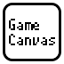

# GameCanvas for Unity

---

**GameCanvas for Unity** は、慶應義塾大学『スマートデバイスプログラミング』にて  
教材として使われている 2Dゲームフレームワーク です。

プログラミング初心者でも、スマートデバイス向けアプリケーションを  
楽しく開発できる環境を目指して開発されました。

#### 資料

- [APIドキュメント](api/GameCanvas.Proxy.html)
- [新旧API対応表](note/compatibility.html)

#### リンク

- [GitHubリポジトリ](https://github.com/sfc-sdp/GameCanvas-Unity)
- [スマートデバイスプログラミング講義ページ](http://web.sfc.keio.ac.jp/~wadari/sdp/)
