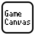

# GameCanvas for Unity

---

**GameCanvas for Unity** は、慶應義塾大学『スマートデバイスプログラミング』にて  
教材として使われている 2Dゲームフレームワーク です。

プログラミング初心者でも、スマートデバイス向けアプリケーションを  
楽しく開発できる環境を目指して開発されました。

#### APIドキュメント

- [IGameCanvas](xref:GameCanvas.GcProxy)
  - [IGraphics](xref:GameCanvas.IGraphics)
  - [ISound](xref:GameCanvas.ISound)
  - [INetwork](xref:GameCanvas.INetwork)
  - [ISceneManagement](xref:GameCanvas.ISceneManagement)
  - [ITime](xref:GameCanvas.ITime)
  - [IPhysics](xref:GameCanvas.IPhysics)
  - [IStorage](xref:GameCanvas.IStorage)
  - [IMath](xref:GameCanvas.IMath)
  - [IInputPointer](xref:GameCanvas.IInputPointer)
  - [IInputKey](xref:GameCanvas.IInputKey)
  - [IInputAcceleration](xref:GameCanvas.IInputAcceleration)
  - [IInputGeolocation](xref:GameCanvas.IInputGeolocation)
  - [IInputCamera](xref:GameCanvas.IInputCamera)

#### リンク

- [GitHubリポジトリ](https://github.com/sfc-sdp/GameCanvas-Unity)
- [スマートデバイスプログラミング講義ページ](http://web.sfc.keio.ac.jp/~wadari/sdp/)
